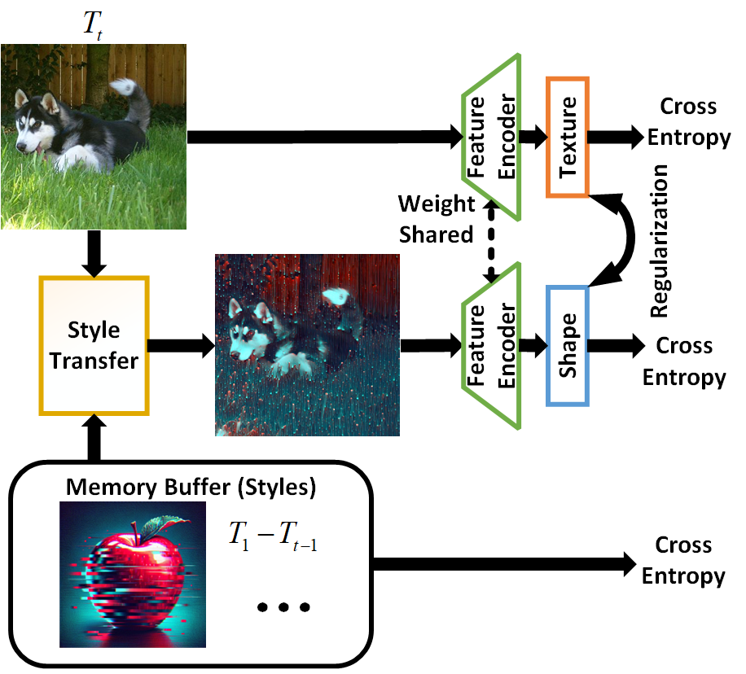

# Distillation-Style CNN in Action: Boosting Continual Learning via Style Transfer 

**Authors:**  Jie Jing, Zenglin Shi, Ying Sun, Joo-Hwee Lim, Mengmi Zhang

**Our paper has been accepted in IEEE Transactions on Neural Networks and Learning Systems.** 
<p align="left">
   <a href="https://ieeexplore.ieee.org/document/10937268" target="_blank"></a>
  &nbsp
  <a href="https://arxiv.org/abs/2211.11174" target="_blank"></a>
  &nbsp
</p> 

## Project Description 

Continual learning aims to empower AI agents to learn new tasks incrementally without forgetting previously acquired knowledge. In this project, we implement the method described in the paper:

**STCR: Enhancing Generalization for Continual Learning through Style Transfer and Content Replay** 

by integrating style-transfer into the learning process to boost generalization and mitigate catastrophic forgetting.
Our approach leverages a *shape-texture consistency regularization (STCR)* mechanism that uses style-transferred images to encourage the model to learn both robust shape and texture features. This enables the network to perform well on out-of-distribution data while retaining historical information from earlier tasks.
<p align="center">
  
</p>

## Environment Setup 

Our codebase is built using Python and PyTorch. We recommend using [conda]()  for dependency management.

### Prerequisites 

 
- Python 3.x
 
- [PyTorch](https://pytorch.org/)  (tested with PyTorch 1.10+)
 
- Other Python packages as listed in `requirements.txt`


### Installation 

 
2. **Clone the repository:** 


```bash
git clone https://github.com/jingcjie/distillation-style-cnn
```
 
4. **Navigate to the project directory:** 


```bash
cd distillation-style-cnn
```
 
6. **Install dependencies:** 


```
pip install -r requirements.txt
```

## Dataset 

This project supports training and evaluation on continual learning benchmarks such as ImageNet and ImageNet100. ImageNet-1K-C can be downloaded from [here](http://paperswithcode.com/dataset/imagenet-c). 

> **Note:**  Ensure you have set the correct dataset paths in the configuration files before training.


## Training & Testing 


Our code structure follows best practices similar to popular continual learning repositories. You can train and test the model using the main script provided.


### Training 


Run the training script with:


```
python main_imagenet.py [arguments]
```


Key command-line arguments include:

 
- `--batch-size`: Batch size (default: 256)
 
- `--epochs1`: Number of epochs for the initial training phase (default: 70)
 
- `--epochs2`: Number of epochs for the incremental phase (default: 40)
 
- `--new-classes`: Number of new classes per incremental step (default: 10)
 
- `--start-classes`: Number of initial classes (default: 50)
 
- `--dataset`: Choose between `imagenet100` or `imagenet`
 
- `--exp-name`: Experiment name for logging
 
- `--no_STCR`: Disable the STCR module (for ablation studies)
 
- `--no_distill`: Disable the distillation loss (if needed)
 
- `--style_type`: Choose the style-transfer method (0: AdaIN, 1: traditional)


### Testing 


To evaluate a pretrained model, run:


```css
python main_imagenet.py [arguments] \
  --checkpoint path/to/your_checkpoint.pth \
  --train False
```


Adjust the configuration files as necessary for your training and testing scenarios.


## Contributing 


Contributions are welcome! Please submit a pull request with your proposed changes or improvements. Make sure to follow the coding guidelines and update documentation accordingly.

## Citation 


If you use this code in your research, please cite our work:


```
@ARTICLE{10937268,
  author={Shi, Zenglin and Jing, Jie and Sun, Ying and Lim, Joo-Hwee and Zhang, Mengmi},
  journal={IEEE Transactions on Neural Networks and Learning Systems}, 
  title={Unveiling the Tapestry: The Interplay of Generalization and Forgetting in Continual Learning}, 
  year={2025},
  volume={},
  number={},
  pages={1-15},
  keywords={Continuing education;Training;Artificial intelligence;Shape;Data models;Prototypes;Buildings;Systematics;Synthetic data;Surveys;Continual learning;generalization;robustness;shape-texture bias},
  doi={10.1109/TNNLS.2025.3546269}}
```


---
